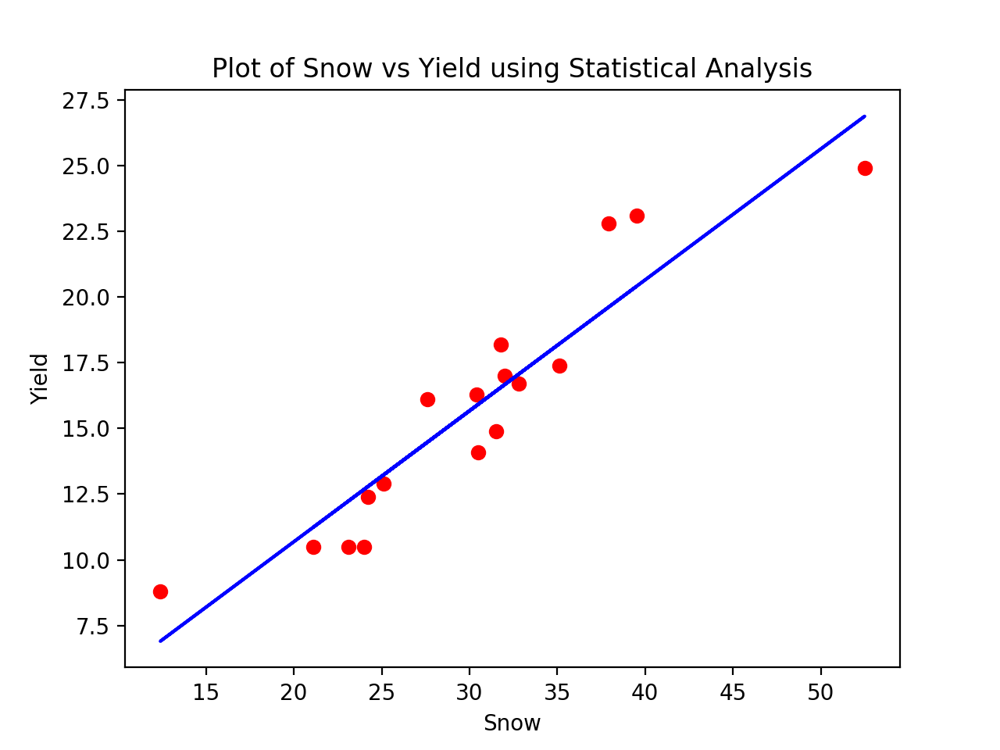
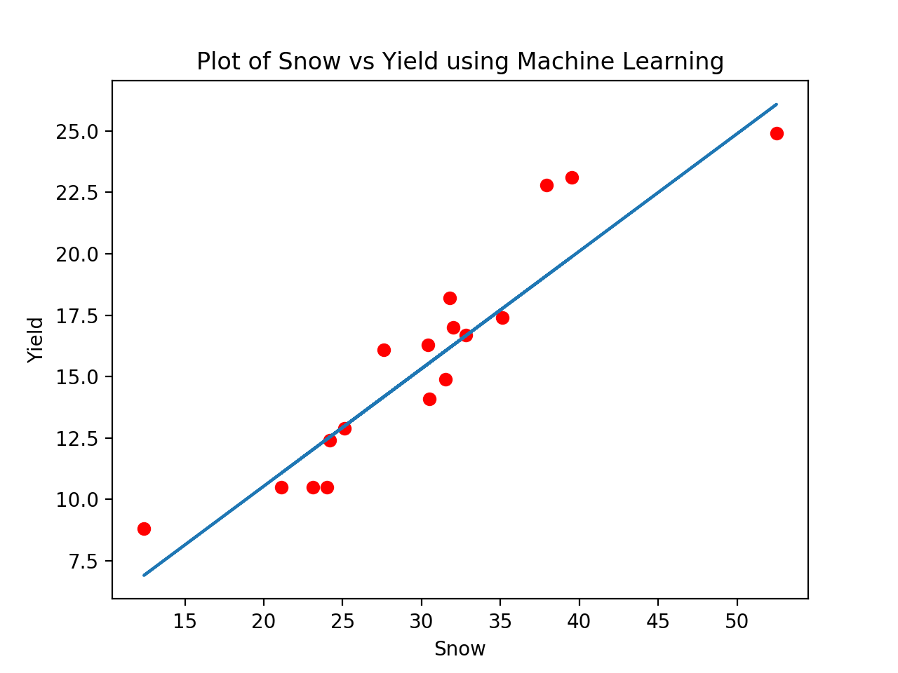

## Regression Analysis Modeling Based-On Optimization (R.A.M.B.O) ##

Covers topics in regression analysis, such as linear regression, logistic regression, B-spline, and support vector machine. In general, each regression method will cover two optimization methods: one through machine learning optimzaition method, and one through statistical method

## Data Load, Display, and Migrate ##
- Data load features:
  - [X] Load Data in 2D or 3D forms
- Data display features:
  - [X] Display data as a 2D plot
  - [X] Display data as a 2D plot with colors
  - [X] Display data as a 3D surface plot
- Data migrate features:
  - [ ] Migrate data to TensorFlow or Torch models

## Himmelblau's function: ##

<table> <tr>
<th> Two-Dimensional Plot </th> <th> Three-Dimensional Plot </th>
</tr>
<tr>
<td>  </td>
<td>  </td>
</tr> </table>

## Linear Regression ##
- [X] Using statistics approach (R-square value)
- [ ] Using machine learning approach (RMSE value)
- [ ] Using multi-parameter variables
- [X] Using TensorFlow and PyTorch

<table> <tr>
<th> Statistical Analysis </th> <th> Machine Learning </th>
</tr>
<tr>
<td>  </td>
<td>  </td>
</tr> </table>

## Logistic Regression ##
- [ ] (Binary or beyond) supervised clasification purpose
- [ ] Using TensorFlow and PyTorch model

## Support Vector Machine ##
- [ ] Binary classification purpose
- [ ] Determine the hyper-plane
- [ ] Using Scikit-Learn hyper-parameter search

## Step-Wise Regression ##
- To be determined

## B-Spline ##
- To be determined

## Parametric Regression ##
- To be determined
