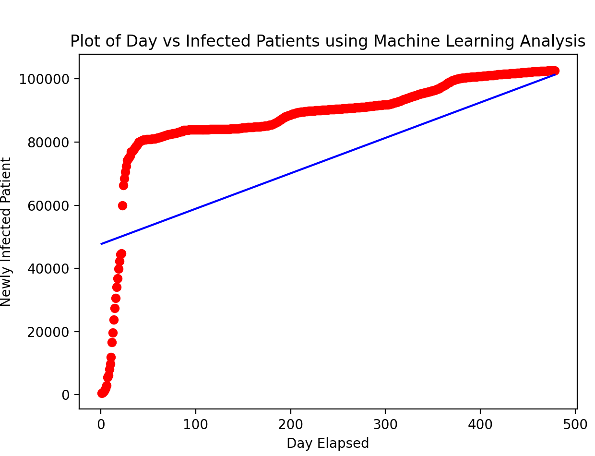

## Regression Analysis Modeling Based-On Optimization (R.A.M.B.O) ##

Covers topics in regression analysis, such as linear regression, logistic regression, B-spline, and support vector machine. In general, each regression method will cover two optimization methods: one through machine learning optimzaition method, and one through statistical method

## Data Load, Display, and Migrate ##
- Data load features:
  - [X] Load data in 2D format (one independent and one dependent variable)
  - [X] Load data in 3D format (three vector arrays)
- Data display features:
  - [X] Display data as a 2D plot
  - [X] Display data as a 2D plot with colors
  - [X] Display data as a 3D surface plot

## Himmelblau's Function: ##

 

 

<table> <tr>
<th> Two-Dimensional Plot </th> <th> Three-Dimensional Plot </th>
</tr>
<tr>
<td>  </td>
<td>  </td>
</tr> </table>

## Linear Regression ##
- [X] Using statistics approach (R-square value)
- [X] Using machine learning approach (RMSE value)
- [X] Using TensorFlow and PyTorch

<table> <tr>
<th> Statistical Analysis </th> <th> Machine Learning </th>
</tr>
<tr>
<td>  </td>
<td>  </td>
<tr>
<td> m = 0.498; b = 0.725 </td>
<td> m = 0.559; b = 0.022 </td>
</tr> </table>

## Stanford Code in Place Spring 2021 - COVID19 Analysis ##
<th> Statistical Analysis </th> <th> Machine Learning </th>
</tr>
<tr>
<td>  </td>
<td>  </td>
<tr>
<td> m = 89.8580; b = 66040.458 </td>
<td> m = 112.245; b = 47667.073 </td>
</tr> </table>

## Support Vector Machine ##
- [ ] Binary classification purpose
- [X] Determine the hyper-plane
<table> <tr>
<th> Initial Iteration </th>
<th> Final Iteration </th>
</tr>
<tr>
<td>  </td>
<td>  </td>
</tr> </table>

 
<b> Support Vector Machine Hyper Plane Determination </b>
 

